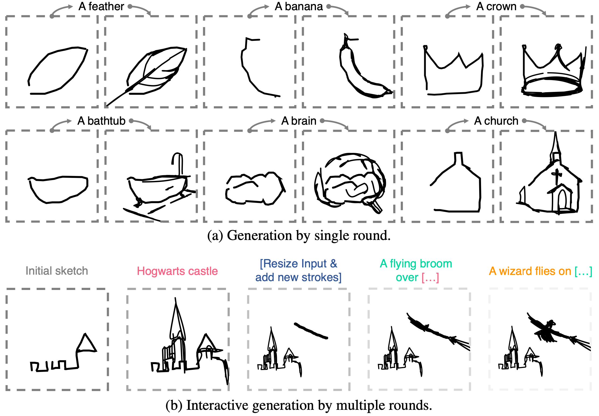

<div align="center">
  
# SketchDreamer: Interactive Text-Augmented <br> Creative Sketch Ideation

<a href="https://pytorch.org/get-started/locally/"></a>
[-6790AC.svg)](https://bmvc2023.org/)
[](https://arxiv.org/abs/2308.14191)

</div>

Artificial Intelligence Generated Content (AIGC) has shown remarkable progress in generating realistic images. However, in this paper, we take a step "backward" and address AIGC for the most rudimentary visual modality of human sketches. Our objective is on the creative nature of sketches, and that creative sketching should take the form of an interactive process. We further enable text to drive the sketch ideation process, allowing creativity to be freely defined, while simultaneously tackling the challenge of "I can't sketch". We present a method to generate controlled sketches using a text-conditioned diffusion model trained on pixel representations of images. Our proposed approach, referred to as SketchDreamer, integrates a differentiable rasteriser of Bezier curves that optimises an initial input to distil abstract semantic knowledge from a pretrained diffusion model. We utilise Score Distillation Sampling to learn a sketch that aligns with a given caption, which importantly enable both text and sketch to interact with the ideation process. Our objective is to empower non-professional users to create sketches and, through a series of optimisation processes, transform a narrative into a storyboard by expanding the text prompt while making minor adjustments to the sketch input. Through this work, we hope to aspire the way we create visual content, democratise the creative process, and inspire further research in enhancing human creativity in AIGC.



## Citation

```
@inproceedings{qu2023sketchdreamer,
  title={SketchDreamer: Interactive Text-Augmented Creative Sketch Ideation},
  author={Qu, Zhiyu and Xiang, Tao and Song, Yi-Zhe},
  booktitle={BMVC},
  year={2023}
}
```

## Instructions


### Dependencies

This repository is based on [CLIPasso](https://github.com/yael-vinker/CLIPasso) and [Stable-Dreamfusion](https://github.com/ashawkey/stable-dreamfusion). We would like to thank the authors of these work for publicly releasing their code. Please follow the dependencies of CLIPasso to install DiffVG. After running CLIPasso successfully, please install the following libraries.

```
pip install --upgrade diffusers accelerate transformers
```

### Training

```
sh run.sh
```
